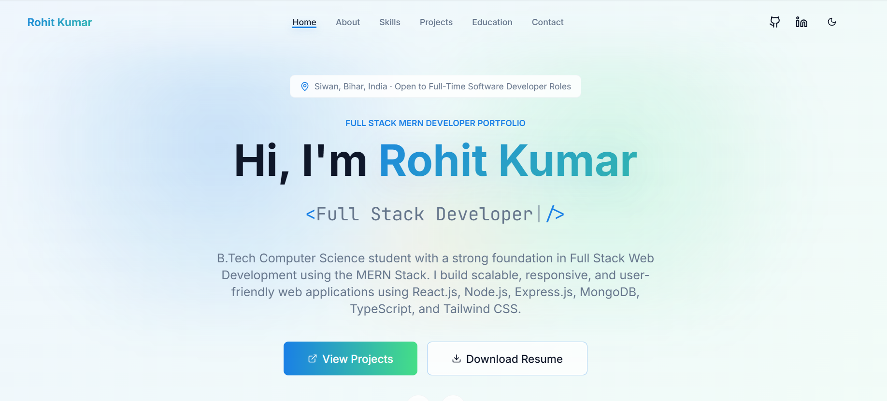

# 🚀 Rohit Kumar - Full Stack Developer Portfolio

A modern, responsive, and professional developer portfolio built using React, TypeScript, Vite, and Tailwind CSS. This portfolio showcases my skills, projects, resume, and contact information.

## 🌐 Live Demo

🔗 https://rohitkumar0-portfolio.netlify.app/

---

## 📸 Preview



---

## ✨ Features

- Responsive Design
- Modern UI/UX
- Dark/Light Theme
- Smooth Scroll Animations
- Project Showcase
- Skills Section
- Resume Download
- Contact Form
- Social Media Links
- Fast Performance

---

## 🛠️ Tech Stack

### Frontend
- React.js
- TypeScript
- Vite
- Tailwind CSS
- Framer Motion
- React Icons

### Tools
- Git
- GitHub
- VS Code
- Netlify

---

## 📂 Project Structure

```
Portfolio
│── public
│── src
│   ├── components
│   ├── hooks
│   ├── lib
│   ├── pages
│   ├── App.tsx
│   ├── main.tsx
│── package.json
│── vite.config.ts
│── README.md
```

---

## ⚙️ Installation

Clone the repository

```bash
git clone https://github.com/Rohitkumar968/portfolio.git
```

Go to project folder

```bash
cd portfolio
```

Install dependencies

```bash
npm install
```

Run the project

```bash
npm run dev
```

Build

```bash
npm run build
```

---

## 👨‍💻 About Me

I'm **Rohit Kumar**, a Final Year B.Tech Computer Science Engineering student passionate about Full Stack Web Development.

I enjoy building responsive, scalable, and user-friendly web applications using modern technologies.

---

## 📄 Resume

You can download my resume directly from the portfolio.

---

## 📬 Contact

**Name:** Rohit Kumar

📧 Email: rohitkumar75997@gmail.com

📱 Phone: +91-6299394952

💼 LinkedIn:
https://www.linkedin.com/in/rohitkumar58

💻 GitHub:
https://github.com/Rohitkumar968

---

## ⭐ Support

If you like this project, don't forget to give it a ⭐ on GitHub.

---

## 📃 License

This project is open-source and available under the MIT License.

---

## 👨‍💻 Made By

**Rohit Kumar**

Full Stack Developer | B.Tech CSE Student

## 📅 Last Updated

**July 2026**